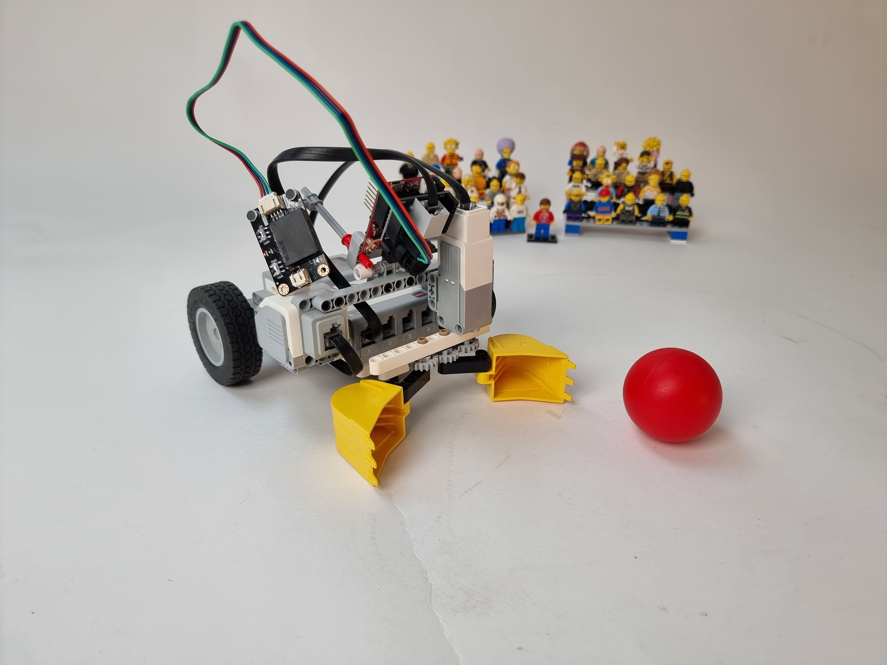

# MINDSTORMS EV3 Voice-controlled grabber robot with OpenMV Camera

This robot is like a pet! You can say: "Turn left 45 degrees," "Go Forward," or: "Fetch Ball!"

See it in action here: https://youtube.com/shorts/Hwkwj7lLJ4g

## How to Run

- Build an EV3 robot with a grabber on Port D and tank drive on C and D
- Run Pybricks/ev3dev on it with a MicroSD card
- Open this folder in VS Code with the MINDSTORMS extension installed.
- Copy sen0539.py to your OpenMV cam
- Copy openmv_main.py to your OpenM main.py
- Run and Debug (F5) to run main.py on the EV3 brick.
